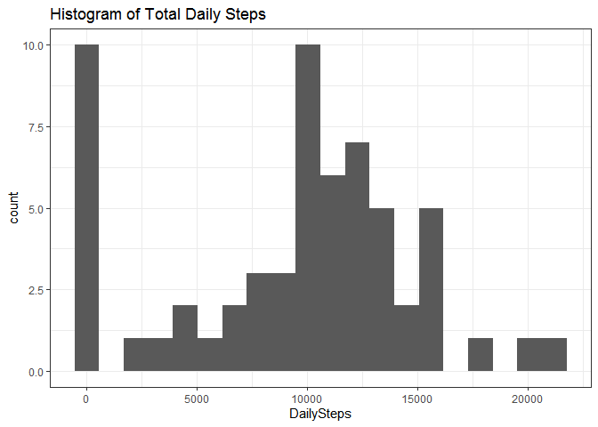
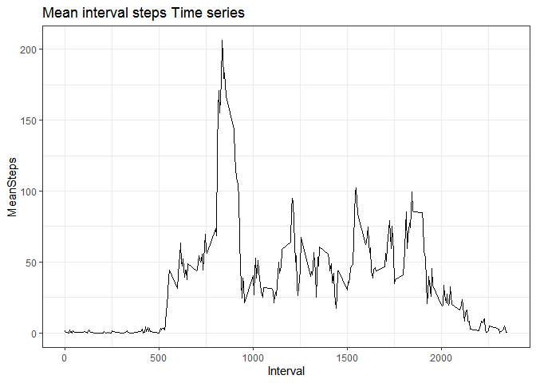
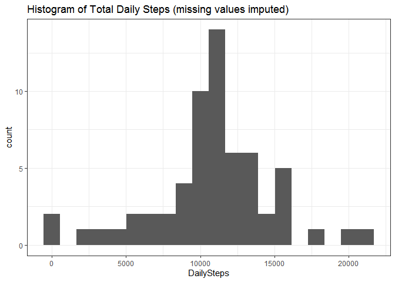
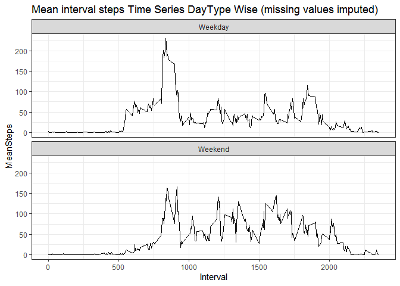

## Loading and preprocessing the data


```r
library(data.table)
library(ggplot2)
library(dplyr)

unzip(zipfile='activity.zip', exdir='.')
info <- fread(file='activity.csv', colClasses=c('numeric','Date','numeric'), 
              col.names=c('Steps', 'Date', 'Interval'))
```


## What is mean total number of steps taken per day?


```r
steps_daily <- info[, .(DailySteps=sum(Steps, na.rm=TRUE)), keyby=Date]

print(paste('Mean of total steps per day =', as.integer(mean(steps_daily$DailySteps))))
```

```
[1] "Mean of total steps per day = 9354"
```

```r
print(paste('Median of total steps per day =', median(steps_daily$DailySteps)))
```

```
[1] "Median of total steps per day = 10395"
```

```r
ggplot(data=steps_daily, mapping=aes(x=DailySteps)) + geom_histogram(bins=20, na.rm=TRUE) + 
  theme_bw() + labs(title='Histogram of Total Daily Steps')
```

<!-- -->

## What is the average daily activity pattern?


```r
mean_intervalSteps <- info[, .(MeanSteps = mean(Steps, na.rm=TRUE)), keyby=Interval]

print(paste('Interval with max average steps =', mean_intervalSteps[which.max(MeanSteps),Interval]))
```

```
[1] "Interval with max average steps = 835"
```

```r
ggplot(data=mean_intervalSteps, mapping=aes(x=Interval, y=MeanSteps)) + geom_line(na.rm=TRUE) + 
  theme_bw() + labs(title='Mean interval steps Time series')
```

<!-- -->

## Imputing missing values

- **Imputation Strategy**: Mean of five minute intervals across days have been used to impute missing values. 
- **Impact on Mean and Median**: After imputing missing values, we obtain different mean and median from their previous values. Both mean and median of daily number of steps have increased.


```r
setnames(mean_intervalSteps, 'Interval', 'Interval_ID')
info_imputed <- copy(info)
info_imputed[is.na(Steps), Steps:=mean_intervalSteps[match(Interval, Interval_ID), MeanSteps]]

steps_daily_imputed <- info_imputed[, .(DailySteps=sum(Steps)), keyby=Date]

print(paste('Total records with missing values =',sum(!complete.cases(info))))
```

```
[1] "Total records with missing values = 2304"
```

```r
print(paste('Mean of total steps per day after imputing missing values =', 
            as.integer(mean(steps_daily_imputed$DailySteps))))
```

```
[1] "Mean of total steps per day after imputing missing values = 10766"
```

```r
print(paste('Median of total steps per day adter imputing missing value =', 
            as.integer(median(steps_daily_imputed$DailySteps))))
```

```
[1] "Median of total steps per day adter imputing missing value = 10766"
```

```r
ggplot(data=steps_daily_imputed, mapping=aes(x=DailySteps)) + geom_histogram(bins=20) + 
  theme_bw() + labs(title='Histogram of Total Daily Steps (missing values imputed)')
```

<!-- -->

## Are there differences in activity patterns between weekdays and weekends?

There are subtle differences in activity patterns. On weekdays, activity is higher during morning hours, while for weekends, activity is higher during afternoon hours.


```r
info_imputed[, DayType := as.factor(if_else(weekdays(Date) %in% c('Saturday','Sunday'), 'Weekend', 'Weekday'))]
mean_intervalSteps_DayType <- info_imputed[, .(MeanSteps = mean(Steps)), keyby = list(DayType, Interval)]

ggplot(data=mean_intervalSteps_DayType, mapping=aes(x=Interval, y=MeanSteps)) + geom_line() + 
  facet_wrap(. ~ DayType, nrow=2, ncol=1) + theme_bw() + 
  labs(title='Mean interval steps Time Series DayType Wise (missing values imputed)')
```

<!-- -->


